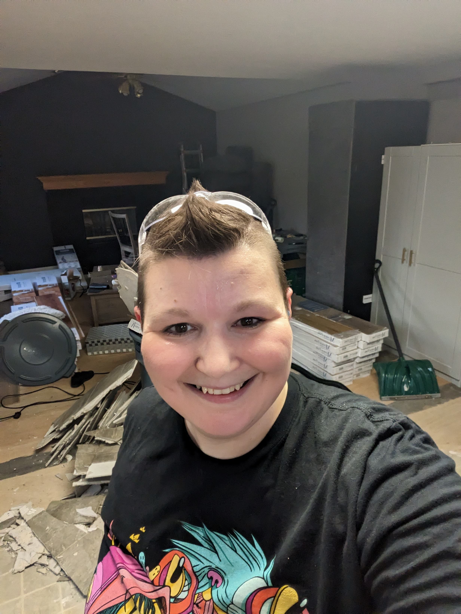

## Just a Tish About Us...

We are a mid-30s couple with two kids.  My husband, son, and daughter are all neurodivergent which gives them superpowers.  I on the other hand try to navigate surviving Complex Trauma from all forms along with living through new traumas as they arrive.  I am undergoing a never-ending fight against Neuroendocrine Cancer (NET Cancer) and Ehlers-Danlos Syndrome.  I am missing part of my lung, thanks to the wonderful Cancer, but refuse to let it slow me down. Anxiety is always at my side like a third saggy boob along with current undiagnosed medical issues.

> If this all seems chaotic it's because it is.  My coping mechanisims are signing myself up for more than I can handle and proving myself wrong.

Just when you thought that was enough for anyone to tackle, well, we purchased our first home on 2/22/22.  We were previously renting and had to rush to buy.  Our home wasn't perfect, but I have a vision in my mind, and plenty of Pinterest boards to back me up of the beautiful home it will turn into.

>If you lost track that is Cancer, Ehlers Danlos Syndrome, Trauma, Anxiety, New Homeowners, Neurodivergent Family Members, and undiagnosed medical problems.

If this sounds at all interesting to you or even a hot mess express that you can't look away from, well follow along!

## 

    
    
    <a class='prev' href='/steamcleaners'>
    

        <svg width="50px" height="50px" viewbox="0 0 24 24" fill="none" xmlns="http://www.w3.org/2000/svg">
            <path d="M13.5 8.25L9.75 12L13.5 15.75" stroke="var(--prevnext-color-angle)" stroke-width="1.5" stroke-linecap="round" stroke-linejoin="round"> </path>
        </svg>
        

            
prev

            
A Deep Dive on my Steam Cleaning Obsessions

        

    </a>
    
    <a class='next' href='/carpet'>
    
        

            
next

            
It's just the Carpet...

        

        <svg width="50px" height="50px" viewbox="0 0 24 24" fill="none" xmlns="http://www.w3.org/2000/svg">
            <path d="M10.5 15.75L14.25 12L10.5 8.25" stroke="var(--prevnext-color-angle)" stroke-width="1.5" stroke-linecap="round" stroke-linejoin="round"></path>
        </svg>
    </a>
  
